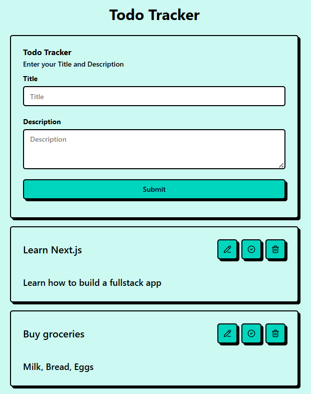
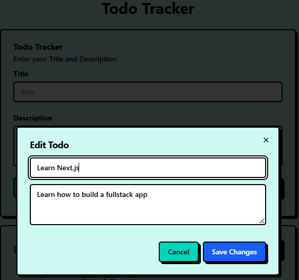
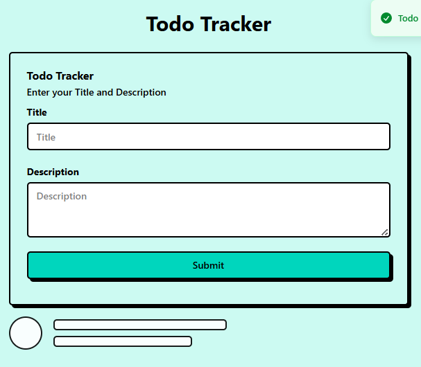
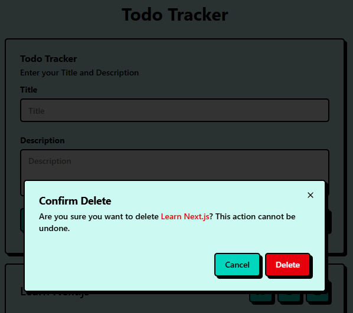

# Todo Tracker

A full-stack Todo Tracker application built with **Express.js, Sequelize, SQLite** (Backend) and **Next.js App Router + Shadcn** (Frontend).

## Screenshots






## 🚀 Tech Stack

### **Backend**

- Node.js + Express.js
- Sequelize ORM
- SQLite database
- REST API architecture
- CORS enabled

### **Frontend**

- Next.js (App Router)
- React client components
- Shadcn UI (Dialog, Button, Card, Input, Sonner)
- NeoBrutalism
- Tailwind CSS
- Fetch API

# 🧩 Features

### Backend

- CRUD Todo API:
  - `GET /todos`
  - `POST /todos`
  - `PUT /todos/:id`
  - `DELETE /todos/:id`
- Validation (title required)
- Error handling for invalid requests
- Uses Sequelize migrations + models
- SQLite for easy local development

### Frontend

- Display todo list
- Add new todo
- Edit todo (with Shadcn Dialog)
- Delete todo (with Confirm Dialog)
- Toggle completed
- Skeleton loading UI
- Error handling + toast notifications (Sonner)
- Clean and responsive UI

# 🛠️ Installation & Running

## ⚙️ Backend Setup

### 1. Install dependencies

```bash
cd todo-backend
npm install
```

### 2. Run Migration

```bash
npx sequelize-cli db:migrate
```

### 3. Start development server

```bash
npm run dev
```

### Backend runs at:

```bash
http://localhost:4000
```

## 🎨 Frontend Setup

### 1. Install dependencies

```bash
cd todo-frontend
npm install
```

### 2. Cretae .env.local

```bash
NEXT_PUBLIC_API_URL=http://localhost:3000
```

### 3. Run frontend

```bash
npm run dev
```

### Backend runs at:

```bash
http://localhost:3000
```
